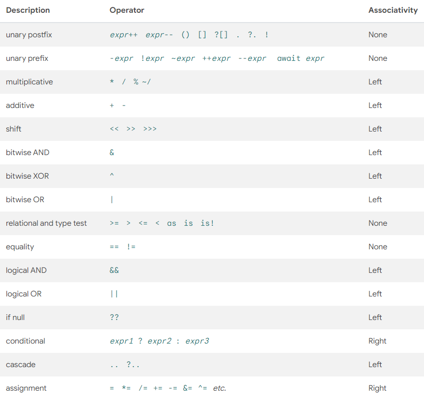

# 运算符

运算符：+ - * / () << >> >>> & | ^ >= <= == !=  && || ?? *= += -= /=

一旦你使用了运算符，就创建了表达式，例如下面

```dart
int a = 2, b = 3;
a + b;
a = b;
a == b;
a is b;
```

运算符列表



在运算符列表中，运算符的优先级按先后排列，第一行优先级最高，然后一次向下，同一行中，最左边的优先级最高，最右边的最低。

## 算数运算符

| 名称 | 符号 |
| ---- | ---- |
| 加 | + |
| 减 | - |
| 乘 | * |
| 除 | / |
| 除并取整 | ~/ |
| 取模 | % |
| 自增 | ++ |
| 自减 | -- |

## 关系运算符

| 名称 | 符号 |
| ---- | ---- |
| 等于 | == |
| 大于 | > |
| 小于 | > |
| 不等于 | != |
| 大于等于 | >= |
| 小于等于 | <= |

## 类型判断运算符

| 名称 | 符号 |
| ---- | ---- |
| 类型转换 | as |
| 是否是这个类型 | is |
| 不是这个类型 | is! |

```dart
int a = 0;
double b = 9;
print(a is double);
print(b is! int);
```

输出：false true

## 赋值运算符

可以使用 `=` 来对变量赋值，同时也可以使用 `??=` 来为值为空的变量赋值

```dart
int? c;
int d = 8;
c ??= d;
print('c value: $c');
```

输出： c value: 8

## 逻辑运算符

| 名称 | 符号 |
| ---- | ---- |
| 对结果取反(非) | ! |
| 与 | && |
| 或 | II |

## 位运算符

| 名称 | 符号 |
| ---- | ---- |
| 按位与| & |
| 按位或 | I |
| 按位异或 | ^ |
| 按位取反 | ~ |
| 左移位 | << |
| 右移位 | >> |
| 无符号右移 | >>> |

## 条件表达式

dart 有两个特殊的运算符可以用来替代 `if -- else` 语句

条件 ？ 表达式1 ： 表达式2

表达式1 ？？ 表达式2

```dart
bool isPublic = false;
var visibility = isPublic ? 'public' : 'private';
print(visibility);

// 一个可选参数的函数
String playerName([String? name]) => name ?? '无名';
print(playerName());
```

输出：private 无名

## 级联运算符

级联运算符可以让你在同一个对象上连续调用多个对象的变量或者方法

```dart
class Person {
  String? name;
  String? sex;
  double? height;
  double? weight;

  Person({this.name, this.sex, this.height, this.weight});
}

// 使用级联进行赋值
var person = Person()
..name = 'Tom'
..sex = '公'
..height = 20
..weight = 40;
```
