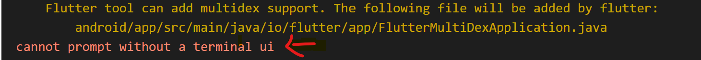
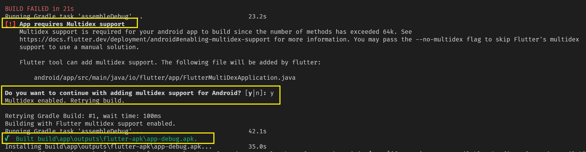

# Flutter 项目编译问题

## 1. Flutter 3.0 调试安卓平台卡住问题

一直卡在 `Running Gradle task 'assembleDebug'...` 这里，可能是因为网络问题，比如国家防火墙干扰。

使用修改地址的方式解决问题:

1. 打开当前项目目录的 `./android/build.gradle` 文件，使用下面代码替换掉 `google()` 和 `mavenCentral()`，这里有两处，分别在 `buildscript` 和 `allprojects` 下面

    ```java
    maven {
        allowInsecureProtocol = true
        url 'https://maven.aliyun.com/repository/google'
    }
    maven {
        allowInsecureProtocol = true
        url 'https://maven.aliyun.com/repository/jcenter'
    }
    maven { 
        allowInsecureProtocol = true 
        url 'http://maven.aliyun.com/nexus/content/groups/public'
    }
    ```

2. 打开 Flutter SDK 下的 `~/flutter/packages/flutter_tools/gradle/flutter.gradle` 文件修改两处代码
    - 在 `buildscript` 中使用第1步的代码替换掉 `google()` 和 `mavenCentral()`
    - 找到 `FlutterPlugin` 类中的 `DEFAULT_MAVEN_HOST` 静态变量，使用下面的地址替换掉。
        ```java
        // 原地址
        // private static final String DEFAULT_MAVEN_HOST = "https://storage.googleapis.com";
        // 替换后的地址
        private static final String DEFAULT_MAVEN_HOST = "https://storage.flutter-io.cn";
        ```

参考资料地址: <https://www.bilibili.com/read/cv22572083>

## 2. Unable to find bundled Java version 解决方法

如果运行 flutter doctor 发现 Android Studio 有一处错误 Unable to find bundled Java version，解决办法如下：

- 如果是 macOS 系统，在 `jbr` 同目录下创建一个 jre 目录，然后将 jbr 目录内的全部文件复制一份到 jre 目录下即可。
- 如果是 Windows 系统，`jre` 目录是存在的，不过里面几乎没东西，可以直接将 jbr 目录内的全部文件复制一份到 jre 目录下即可。

然后在终端运行 flutter doctor 查看是否还会报错

## 3. 升级到 Xcode 14.3 出现的编译问题

### 问题描述
如果出现找不到 `libarclite_iphonesimulator.a` 文件，错误信息如下所示:

```shell
ld: file not found: /Applications/Xcode.app/Contents/Developer/Toolchains/XcodeDefault.xctoolchain/usr/lib/arc/libarclite_iphonesimulator.a
clang: error: linker command failed with exit code 1 (use -v to see invocation)
```

从报错信息看，都是在链接库的时候因为找不到静态库(libarclite_iphonesimulator.a/libarclite_iphoneos.a)而报错。利用访达的前往文件夹功能快速来到报错信息中的目录，发现连arc目录都不存在，更不用说静态库文件。

现在可以确定的是Xcode 14.2版本肯定是正常的，那会不会是14.3版本移除了整个arc目录？找到一台还没升级到Xcode 14.3版本的电脑，在同样的路径下，果然存在arc目录。

### 问题原因
根据查阅一些资料得出，系统已经内置有ARC相关的库，所以没必要再额外链接，至少Xcode 14支持的最低部署目标iOS 11及以上版本的系统肯定是没问题的。如果应用部署目标不低于iOS 11还出现问题，那么应该是第三方库的部署目标有问题。

现在Xcode 14.3移除arc目录的原因已经很清楚，是因为支持的最低部署版本的系统都已经内置了ARC相关的库。如果应用最低部署目标版本本身不低于iOS 11，解决这个问题很简单，只需要将第三方库部署目标的iOS版本设置成和应用最低部署目标的iOS版本一致。

在我的项目中，应用最低部署目标是iOS 12.0版本，可能是某个三方库最低目标版本低于 iOS 11.0，于是找了一下找到了 FMDB 这个库，最低版本是 iOS 8.0，如何更改？？？

### 如何解决
1. 找到 iOS 工程的 `Podfile` 文件。
2. 找到如下代码

    ```ruby
    post_install do |installer|
      installer.pods_project.targets.each do |target|
        flutter_additional_ios_build_settings(target)
        # 在这里插入代码
      end
    end
    ```
    
3. 插入以下代码，这里统一设置最低编译版本为 iOS 11.0 （版本根据项目情况来定）

    ```ruby
    target.build_configurations.each do |config|
      config.build_settings['IPHONEOS_DEPLOYMENT_TARGET'] = '11.0'
    end
    ```
    
4. 最终的代码效果如下所示

    ```ruby
    post_install do |installer|
      installer.pods_project.targets.each do |target|
        flutter_additional_ios_build_settings(target)
        target.build_configurations.each do |config|
          config.build_settings['IPHONEOS_DEPLOYMENT_TARGET'] = '11.0'
        end
      end
    end
    ```
        
    修改完代码之后，重新执行一下 `pod install` 即可解决问题。
    > 参考资料： https://blog.csdn.net/crasowas/article/details/129901398

## 4. `AndroidManifext.xml` 文件中 `android: name` 是什么

1. 有如下 xml 文件，路径: `/android/app/main/AndroidManifext.xml`

    ```xml
    <manifest xmlns:android="http://schemas.android.com/apk/res/android"
    package="com.example.skeleton">
    <application
        android:label="skeleton"
        android:name="${applicationName}"
        android:icon="@mipmap/ic_launcher">
    ```


2. `android: name` 是什么？
    - Android Application是android应用程序，一个apk就是一个Android Application。每一个 Application 都是由 Activity、service 等 Android 基本组件所组成。 其中，AndroidManifest.xml 中的 application 标签中的 `android:name` 属性，用来设置 activity 属于哪个 Application，默认为 `android.app.Application`。

    - 为了便于个性化开发，也可进行自定义，如:

        ```java
        public class MyTestApplication extends Application {

        } 
        ```

        这个类的作用是为了放一些全局的和一些上下文都要用到的变量和方法。

3. android: name 默认值

    该值由 `Flutter Gradle` 插件设置。 它可以有 2 个值：

    - 如果您启用了 `multidex` 并且您的应用程序的 minSdk 小于 20，则此值将为 `io.flutter.app.FlutterMultiDexApplication`。 否则，它将是 `android.app.Application`。

    - 您可以通过设置属性来覆盖此值base-application-name（例如，在您的 android 文件夹的 gradle.properties 中）。

    - 如果 build.gradle 文件的 `defaultConfig` 设置了 `manifestPlaceholders` 占位符属性，可以使用如下方式增加一个默认值，否则会报错。

        ```gradle
        defaultConfig {
            // 其他配置 ...
            manifestPlaceholders = [
                // 其他配置 ...

                applicationName : "android.app.Application",
            ]
        }
        ```
    
    > 参考资料: https://stackoverflow.com/questions/70957389/what-does-the-applicationname-in-flutter-androidmanifest-xml-means

    > `manifestPlaceholders`的使用请参考: https://blog.csdn.net/chuyouyinghe/article/details/129951838

## 5. App requires Multidex support in flutter?

    如图所示

    
    
    如果运行项目报错，需要支持 `Multidex` 可以在终端中运行 `flutter run`，然后会自动执行，如下图所示:

    

    这样就会自动在 `android` 目录生成相关的文件。

## 6. What went wrong: [ ] Execution failed for task ':qr_code_scanner:parseDebugLocalResources'
    
    - 错误原因
     如果你导入 `qr_code_scanner` 框架遇到以上问题，错误原因：PlatformAttrTransform 执行失败：/Users/xxx/Library/Android/sdk/platforms/android-32/android.jar ，这是因为没有找到 `android.jar` 这个文件。

    - 解决方法
     可以删除 `/Users/xxx/Library/Android/sdk/platforms/` 文件夹下面的 `android-32` 文件夹，然后重新运行项目会自动生成一个 `android-32` 文件夹。

## 7. 获取依赖报错: Got socket error trying to find package coverage at http://pub.dartlang.org

再添加了新的第三方库，获取依赖报错，意思是连接https://pub.dartlang.org配置dart包失败，需要配置国内镜像，Linux 和 macOS 中的解决办法如下所示: 

```shell
export PUB_HOSTED_URL=https://pub.flutter-io.cn 
export FLUTTER_STORAGE_BASE_URL=https://storage.flutter-io.cn
```

然后重新执行 `flutter pub get` 获取依赖

## 8. Xcode 运行出错 (“CFBundleExecutable” is not specified)

解决方法：

1. 打开 `Xcode 工程文件` -> `Build Settings`
2. 找到 `Packaging` 选项
3. 找到 `Generate info.plist file` 选项，将其值设置为 `YES`

## 9. Sandbox: rsync.samba(12698) deny(1)

Xcode 15 报错： 

Sandbox: rsync.samba(12698) deny(1) file-write-create /Users/shrek/Library/Developer/Xcode/DerivedData/PhotoPC-dejmlgrmwbxazrgvfwpxvhadwsuy/Build/Products/Debug-iphonesimulator/PhotoPC.app/Frameworks/Alamofire.framework/.Alamofire.ihLdr1

Sandbox: rsync.samba(12698) deny(1) file-write-create /Users/shrek/Library/Developer/Xcode/DerivedData/PhotoPC-dejmlgrmwbxazrgvfwpxvhadwsuy/Build/Products/Debug-iphonesimulator/PhotoPC.app/Frameworks/Alamofire.framework/.Info.plist.vn2fty


解决办法：在 `Build Settings` 中找到 `User script sandboxing` 选项，设置成 NO

## 10. 安卓项目运行出现 Exception in thread "main" java.util.zip.ZipException: zip END header not found at  的错误

新建安卓项目，运行出现报错：Exception in thread "main" java.util.zip.ZipException: zip END header not found at ，这主要是由于用户文件夹中的 `.gradle` 文件夹中存在弯曲或不完整的文件。只需找到它并删除它，然后再次运行它，但这次请确保您已连接到互联网以重新下载它。

>原文链接: https://stackoverflow.com/questions/68131529/android-studio-throws-exception-while-running-flutter-app/68855690#68855690

运行如下命令:

```shell
cd ~
rm -rf .gradle
```

然后重新运行项目即可。